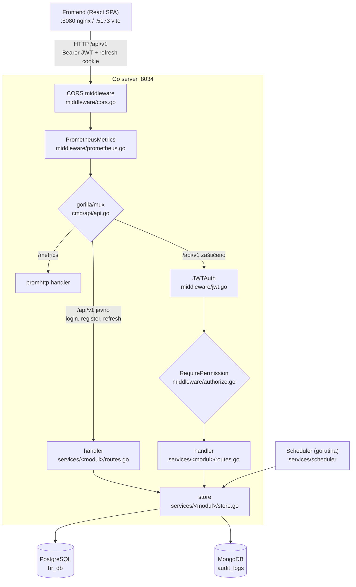
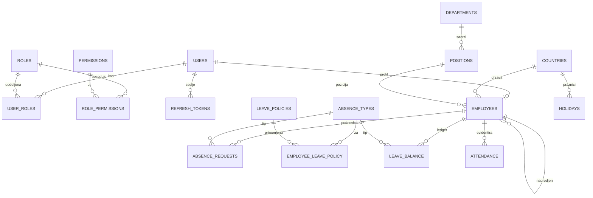
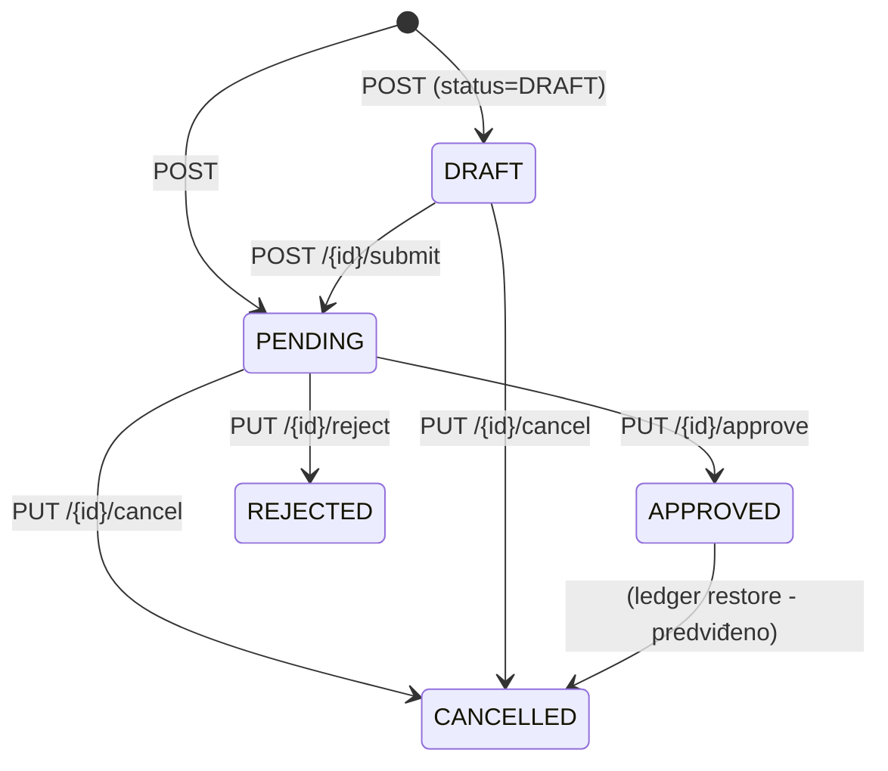

# HR Sistem

Ovaj projekat je razvijen u okviru predmeta **WEB2** na **Prirodno-matematičkom fakultetu u Kragujevcu**.
Cilj projekta je implementacija centralizovanog HR sistema sa koji omogućava upravljanje zaposlenima, njihovim odsustvima i evidencijom prisustva, uz praćenje svih promena u sistemu kroz audit log. 

Sistem je zasnovan na role-based pristupu, gde različiti tipovi korisnika (platform admin, HR admin, menadžer, zaposleni) imaju definisana prava pristupa i akcije koje mogu izvršavati.

---

## Sadržaj

1. [Pregled funkcionalnosti](#1-pregled-funkcionalnosti)
2. [Tehnološki stack](#2-tehnološki-stack)
3. [Arhitektura](#3-arhitektura)
4. [Pokretanje projekta](#4-pokretanje-projekta)
5. [Bezbednost: autentifikacija i autorizacija](#5-bezbednost-autentifikacija-i-autorizacija)
6. [Model podataka (PostgreSQL)](#6-model-podataka-postgresql)
7. [Domenska pravila i algoritmi](#7-domenska-pravila-i-algoritmi)
8. [Audit log (MongoDB)](#8-audit-log-mongodb)
9. [REST API specifikacija](#9-rest-api-specifikacija)
10. [Frontend](#10-frontend)
11. [Kontejnerizacija i deployment](#11-kontejnerizacija-i-deployment)
12. [Testiranje](#13-testiranje)
13. [Poznata ograničenja i moguća unapređenja](#13-poznata-ograničenja-i-moguća-unapređenja)

---

## 1. Pregled funkcionalnosti

| Modul | Funkcionalnosti |
| --- | --- |
| **Autentifikacija** | Registracija, prijava, JWT access token, refresh token u httpOnly kolačiću, odjava, promena lozinke, tiho osvežavanje sesije |
| **Korisnici i uloge** | Lista korisnika, aktivacija/deaktivacija naloga, dodela uloge, pregled dozvola po ulozi |
| **Zaposleni** | Samostalno popunjavanje profila (onboarding), HR kreiranje naloga + profila, pregled svih zaposlenih, izmena, nadređeni, pozicija, departman, država |
| **Odsustva (time-off)** | Podnošenje zahteva, nacrti (DRAFT), izmena i podnošenje nacrta, otkazivanje, odobravanje/odbijanje, tipovi odsustva, preklapanje, radni dani |
| **Balans dana (leave balance)** | Ledger dana, dodela (grant), ručna korekcija, prenos (carry-over), istek, godišnji/mesečni obračun |
| **Politike odsustva** | Definicije politika, dodela politike zaposlenom, automatski obračun po tipu politike |
| **Prisustvo (attendance)** | Prijava/odjava (clock-in/out), status, lična istorija, admin pregled po zaposlenom/departmanu |
| **Audit log** | Evidencija svih važnih akcija u MongoDB, filteri po entitetu i akciji |

---

## 2. Tehnološki stack

| Sloj | Tehnologija |
| --- | --- |
| Backend | **Go 1.25**, `net/http`, `gorilla/mux`, `database/sql` + `lib/pq`, `golang-jwt/jwt/v5`, `golang.org/x/crypto/bcrypt`, `go-playground/validator` |
| Baze | **PostgreSQL 15** (primarna), **MongoDB 7** (audit log) |
| Frontend | **React 19**, **TypeScript**, **Vite**, **Chakra UI v3**, `react-router-dom v7` |
| Monitoring | **Prometheus**, **Grafana** |
| Kontejneri | **Podman** / Docker + `podman-compose` |
| Migracije | `golang-migrate` (`migrate/migrate`) |
| Testovi | Go `testing` (+ DB integracioni), **Playwright** (E2E) |

> **Napomena o modulu:** backend Go modul se zove `main` (ne domen), pa su importi tipa `main/services/user`, `main/types/absence`. Ne koriste se relativni importi.

---

## 3. Arhitektura

Backend je organizovan slojevito:

```
HTTP zahtev
   │
   ▼
[middleware] CORS → PrometheusMetrics → JWTAuth (opciono) → RequirePermission (opciono)
   │
   ▼
[services/<modul>/routes.go]  handler (HTTP sloj, validacija, status kodovi)
   │
   ▼
[services/<modul>/store.go]   pristup bazi (SQL / Mongo)
   │
   ▼
PostgreSQL / MongoDB
```

### 3.1 Struktura repozitorijuma

```
HR-Sistem/
├── backend/
│   ├── cmd/
│   │   ├── main.go                 # ulazna tačka: DB, Mongo, scheduler, server
│   │   └── api/api.go              # mux ruter, DI (store/handler), registracija ruta
│   ├── services/
│   │   ├── user/                   # auth + korisnici (routes.go, store.go)
│   │   ├── employee/               # zaposleni
│   │   ├── absence/                # odsustva, balans, politike, rollover
│   │   ├── attendance/             # prisustvo
│   │   ├── audit/                  # audit log (Mongo)
│   │   ├── auth/                   # bcrypt, JWT, refresh token, hash
│   │   └── scheduler/              # periodični poslovi
│   ├── middleware/                 # jwt.go, authorize.go, cors.go, prometheus.go
│   ├── types/                      # interfejsi i DTO-ovi po modulu
│   ├── utils/                      # ParseJSON, WriteSuccess/WriteError, validator
│   ├── internal/database/          # konekcija na Postgres (gorm → *sql.DB)
│   ├── Dockerfile
│   └── go.mod
├── frontend/
│   ├── src/
│   │   ├── api/client.ts           # fetch wrapper + auto-refresh
│   │   ├── auth/                   # jwt.ts (decode), types.ts
│   │   ├── providers/AuthProvider   # stanje sesije
│   │   ├── theme/system.ts          # brend paleta + tipografija (Chakra system)
│   │   ├── styles/fonts.css         # lokalni Inter (@font-face)
│   │   ├── components/             # Menu, Brand, Account/ChangePasswordCard, ui/*
│   │   ├── pages/                  # stranice po modulima
│   │   └── routes/                 # ruter + ProtectedRoute
│   ├── public/                     # favicon.png, apple-touch-icon.png, logo.png, fonts/
│   ├── e2e/                        # Playwright testovi
│   ├── playwright.config.ts
│   └── nginx.conf                  # SPA + /api proxy
├── migrations/                     # 001..018 (up/down)
├── scripts/                        # seed-test-data.sh, run-go-tests.sh
├── deploy/                         # migrate.Dockerfile, prometheus.yml, grafana provisioning
├── podman-compose.yml
└── Makefile
```

### 3.2 Dva podsistema za pristup bazi

- **PostgreSQL** — relacioni podaci (`database/sql` + `lib/pq`). GORM se koristi isključivo za dobijanje `*sql.DB` handle-a (`gormDB.DB()`), dok svi upiti idu kroz sirovi SQL.
- **MongoDB** — audit log (kolekcija `audit_logs`), dokument-orijentisano, bez šeme.

### 3.3 Životni ciklus zahteva (primer)

```
POST /api/v1/absences/requests
 → CORS (provera Origin)
 → PrometheusMetrics (merenje trajanja i broja zahteva)
 → JWTAuth(db)   (validacija tokena, provera is_active, osvežavanje role iz baze)
 → RequirePermission? (za admin rute)
 → absence.handleCreateRequest
      → resolveEmployeeID (employeeStore.GetByUserID)
      → computeBusinessDays (vikendi + praznici)
      → enforceBalance (ukoliko je PENDING)
      → store.CreateRequest (transakcija: provera preklapanja + insert)
      → logAudit (Mongo)
 → 201 Created (JSON)
```

### 3.4 Tok zahteva (request flow)

```
                            ┌───────────────────────────────┐
                            │      FRONTEND (React SPA)     │
                            │  :8080 (nginx)  ili  :5173    │
                            │   api/client.ts → fetch       │
                            └───────────────┬───────────────┘
                                            │  HTTP/1.1
              Authorization: Bearer <JWT>   │  Content-Type: application/json
              cookie: refreshToken          │  /api/v1/...
                                            ▼
        ┌─────────────────────────────────────────────────────────────────┐
        │                    GO SERVER  (:8034)                           │
        │                                                                 │
        │  [1] CORS                middleware/cors.go                     │
        │         ↓                (Origin allow-lista, preflight OPTIONS)│
        │  [2] PrometheusMetrics   middleware/prometheus.go               │
        │         ↓                (broj zahteva + trajanje, /metrics)    │
        │                                                                 │
        │  ┌───────────────────────────────────────────────────────────┐  │
        │  │ GORILLA MUX ROUTER            cmd/api/api.go              │  │
        │  └──────────────┬────────────────────────────┬───────────────┘  │
        │                 │                            │                  │
        │        /api/v1  (JAVNO)            /api/v1  (ZAŠTIĆENO)         │
        │                 │                            │                  │
        │                 │                    [3] JWTAuth                │
        │                 │                 middleware/jwt.go             │
        │                 │       (potpis/alg, is_active, sveža uloga)    │
        │                 │                            │                  │
        │                 │                    [4] RequirePermission       │
        │                 │                middleware/authorize.go         │
        │                 │             (po ruti: provera role_permissions)│
        │                 │                            │                  │
        │                 ▼                            ▼                  │
        │         ┌──────────────────────────────────────────┐           │
        │         │            HANDLER (HTTP sloj)           │           │
        │         │      services/<modul>/routes.go          │           │
        │         │  ParseJSON → validator → logika → Write  │           │
        │         └──────────────────┬───────────────────────┘           │
        │                            │                                   │
        │         ┌──────────────────┴───────────────────────┐           │
        │         │        STORE (repository sloj)           │           │
        │         │      services/<modul>/store.go           │           │
        │         │        (sirovi SQL preko *sql.DB)        │           │
        │         └────────────┬───────────────────┬─────────┘           │
        │                      │                   │                     │
        └──────────────────────┼───────────────────┼─────────────────────┘
                               ▼                   ▼
                     ┌──────────────────┐  ┌────────────────────────┐
                     │   PostgreSQL     │  │  MongoDB               │
                     │  hr_db (5432)    │  │  hrsystem_audit        │
                     │  korisnici,      │  │  kolekcija:            │
                     │  zaposleni,      │  │  audit_logs            │
                     │  odsustva,       │  └────────────────────────┘
                     │  balans, ...     │
                     └──────────────────┘
                               ▲
                               │  (paralelno, van HTTP toka)
                     ┌─────────┴───────────────────────────────┐
                     │  SCHEDULER (gorutina)                    │
                     │  services/scheduler                      │
                     │  start + svakih 1h → RolloverYear,        │
                     │  RunMonthlyAccrual, RunExpiration         │
                     │  → koristi absence store → PostgreSQL     │
                     └───────────────────────────────────────────┘
```



**Mapiranje generičkih slojeva na naš projekat:**

| Generički sloj | Kod nas | Fajl |
| --- | --- | --- |
| CORS Middleware | ✅ isto | `backend/middleware/cors.go` |
| Auth Middleware | ✅ `JWTAuth` (+ `RequirePermission`) | `middleware/jwt.go`, `middleware/authorize.go` |
| Logging Middleware | ⚠️ ne postoji kao middleware (logovanje je `log.Printf` u handlerima); umesto njega **metrike** | `middleware/prometheus.go` |
| Gorilla Mux Router | ✅ isto | `backend/cmd/api/api.go` |
| Handler | ✅ | `backend/services/<modul>/routes.go` |
| **Service** | ❌ ne postoji kao poseban sloj — poslovna pravila su u handleru | — |
| Repository / DB | ✅ `Store` (sirovi SQL) | `backend/services/<modul>/store.go` |
| — | ✅ Audit kao drugi izvor podataka | `backend/services/audit/store.go` → MongoDB |

> **Bitno:** backend je **dvoslojan** (`handler` → `store`), a ne troslojan (`handler` → `service` → `repository`). Atomske operacije nad bazom su u store-u, dok su poslovna pravila (radni dani, preklapanje, provera balansa) u handleru.

**Primer kroz ceo lanac** — `PATCH /api/v1/absences/requests/17`:

```
Frontend api("/api/v1/absences/requests/17", { method: "PATCH", ... })
  → CORS                     (origin dozvoljen)
  → PrometheusMetrics        (start merenja)
  → JWTAuth(db)              (validan potpis, nalog aktivan, uloga iz baze)
  → (nema RequirePermission — self-service ruta)
  → absence.handleUpdateRequest
        extractClaims → resolveEmployeeID → GetRequestByID
        provera vlasništva i statusa (DRAFT/PENDING)
        computeBusinessDays  → store.GetHolidays(...)   → PostgreSQL
        store.UpdateRequest  → tx: hasOverlap + UPDATE  → PostgreSQL
        logAudit("absence.request.update", ...)         → MongoDB
  → WriteSuccess 200
  → PrometheusMetrics        (upis metrike sa statusom 200)
```

Primer kada dozvola zaustavlja zahtev pre handlera:

```
GET /api/v1/employees  (EMPLOYEE token)
  → JWTAuth → RequirePermission(db, "employees.read")
  → 403 "Zabranjen pristup: nedostaje dozvola employees.read"
```

---

## 4. Pokretanje projekta

### 4.1 Preduslovi

- Podman (ili Docker) i `podman-compose`
- Go 1.25 (za lokalni razvoj bez kontejnera)
- Node.js 22+ (frontend)
- Slobodni portovi: **5433, 27017, 8034, 8080, 9090, 3000**

> Na Fedori: sistemski `mongod` mora biti zaustavljen jer zauzima port 27017:
> `sudo systemctl stop mongod && sudo systemctl disable mongod`
> Rootless Podman ne može da veže port 80, zato je frontend na **8080:80**.

### 4.2 Konfiguracija (`.env`)

`.env` u korenu se koristi za lokalno pokretanje (host):

```
DB_HOST=localhost
DB_PORT=5433
POSTGRES_USER=hr_user
POSTGRES_PASSWORD=<lozinka>
POSTGRES_DB=hr_db
DB_SSLMODE=disable
MONGO_URI=mongodb://localhost:27017
MONGO_DB=hrsystem_audit
```

U kontejnerima se `DB_HOST=db`, `DB_PORT=5432`, `MONGO_URI=mongodb://mongo:27017` zadaju kroz compose.

### 4.3 Produkciono pokretanje (kontejneri)

Ceo sistem (baze, migracije, API, UI, monitoring) se podiže jednom komandom.

```sh
# 1) izgradnja slika backend-a i frontend-a
podman compose build

# 2) podizanje svih servisa u pozadini
podman compose up -d
```

**Servisi i portovi:**

| Servis | Kontejner | Port (host → kontejner) |
| --- | --- | --- |
| PostgreSQL | `hr_db` | 5433 → 5432 |
| MongoDB | `hr_mongo` | 27017 → 27017 |
| Migracije | `hr-sistem_migrate_1` (one-shot) | — |
| Backend (Go API) | `hr_backend` | 8034 → 8034 |
| Frontend (nginx) | `hr_frontend` | 8080 → 80 |
| Prometheus | `hr_prometheus` | 9090 → 9090 |
| Grafana | `hr_grafana` | 3000 → 3000 |

- Aplikacija (UI): **http://localhost:8080**
- API: **http://localhost:8034/api/v1**
- Grafana: http://localhost:3000 (admin/admin)
- Prometheus: http://localhost:9090

**Provera da je sve zdravo:**

```sh
podman ps --format "table {{.Names}}\t{{.Status}}\t{{.Ports}}"
curl -s -o /dev/null -w "UI: %{http_code}\n"     http://localhost:8080/
curl -s -o /dev/null -w "API: %{http_code}\n"    http://localhost:8034/metrics
podman logs hr-sistem_migrate_1 | tail          # izlaz migracija
```

> **Važno (česta zamka):** `podman compose up -d` **ne** zamenjuje kontejner ako
> se promenio samo image (npr. posle `build`). Posle izmene koda uvek uradi:
>
> ```sh
> podman compose build && podman compose down && podman compose up -d
> ```
>
> `podman rm -f <kontejner>` ume da padne ako postoje kontejneri koji zavise od
> njega, pa je `down && up -d` najsigurniji način.

**Zaustavljanje i reset:**

```sh
podman compose down       # zaustavi, ali čuva volumene (pgdata, mongodata)
podman compose down -v    # BRIŠE bazu, audite i dashboarde — čist start
podman logs -f hr_backend # logovi API-ja uživo
```

Reset baze od nule (migracije se ponovo izvršavaju):

```sh
podman compose down -v && podman compose up -d
```

### 4.4 Razvojni režim (dev)

U razvoju se zadržavaju **baze u kontejnerima**, a backend i frontend se pokreću
lokalno — tako rade hot-reload i debagovanje.

```sh
# 1) samo baze (Postgres na 5433, Mongo na 27017)
podman compose up -d db mongo

# 2) backend lokalno — sam učitava ../.env (godotenv) → http://localhost:8034
cd backend && go run ./cmd

# 3) frontend sa Vite dev serverom → http://localhost:5173
cd frontend && npm install && npm run dev
```

- Vite proxy je već podešen: `/api` sa `:5173` ide na `:8034` (`vite.config.ts`).
- Backend u `cmd/main.go` čita `../.env`; ako fajl ne postoji, koristi promenljive
  okruženja. Zato u dev režimu `.env` mora imati `DB_HOST=localhost` i `DB_PORT=5433`.
- Za automatski restart backenda na izmenu koda: `cd backend && air` (konfiguracija
  je u `backend/.air.toml`).

Frontend može i bez kontejnera, a backend u kontejneru — tada se u `.env` i dalje
koristi `localhost:8034`, jer je port objavljen na host.

**Testni podaci (dev i E2E):**

```sh
sh scripts/seed-test-data.sh           # kreira 4 test naloga
sh scripts/seed-test-data.sh --clean   # briše njih i njihove podatke
```

| Nalog | Uloga |
| --- | --- |
| `e2e-admin@hr-sistem.com` | PLATFORM_ADMIN |
| `e2e-hr@hr-sistem.com` | HR_ADMIN |
| `e2e-manager@hr-sistem.com` | MANAGER_PORTAL_ACCESS |
| `e2e-employee@hr-sistem.com` | EMPLOYEE (15 dana godišnjeg) |

Lozinka: `E2eTest1!`. Skripte isto postoje i kao `npm run e2e:seed` / `npm run e2e:clean`.

`Makefile` pomaže oko portova: `make restart` (zaustavi `mongod`, proveri portove,
očisti kontejnere i podigne stack).

### 4.5 Česti problemi

| Simptom | Uzrok i rešenje |
| --- | --- |
| `bind: address already in use` na 27017 | Sistemski MongoDB drži port: `sudo systemctl stop mongod && sudo systemctl disable mongod` |
| `lookup db: no such host` | Backend pokrenut na hostu, a u okruženju je `DB_HOST=db` (ime iz compose mreže). Na hostu koristi `localhost` i port `5433`. |
| `password authentication failed for user "hr_user"` | Postojeći `pgdata` volume je napravljen sa drugom lozinkom. Uskladi `.env` ili resetuj: `podman compose down -v` |
| `duplicate migration file` | Stara slika migratora. Ponovo izgradi bez keša: `podman build --no-cache -t hr-sistem_migrate -f deploy/migrate.Dockerfile .` |
| Promena koda se ne vidi u kontejneru | `up -d` ne menja image — vidi napomenu u 4.3 (`build && down && up -d`) |
| Port 80 nedostupan | Rootless Podman ne može da veže 80 — frontend je zato na **8080** |
| `relation "permissions" does not exist` | Migracije su se izvršile delimično/drugim redom — `down -v` pa `up -d` |

---

## 5. Bezbednost: autentifikacija i autorizacija

### 5.1 Tokeni

- **Access token** — JWT (HS256), sadrži `user_id`, `email`, `role`, `exp` (**20 minuta**), `iat`. Čuva se **samo u memoriji** frontenda (nema `localStorage`).
- **Refresh token** — 32 nasumična bajta (base64), čuva se **hashiran (SHA-256)** u tabeli `refresh_tokens`. Klijentu se šalje kao **httpOnly kolačić**:
  - `Path=/api/v1`, `HttpOnly`, `SameSite=Strict`, `Secure=false` (razvoj), trajanje 7 dana.

> **Zašto `Path=/api/v1` a ne `/api/v1/refresh`?** Kolačić mora da stigne i do `POST /api/v1/logout` (da bi se token opozvao), pa putanja mora pokriti oba endpointa.

### 5.2 `JWTAuth` middleware (`middleware/jwt.go`)

1. Čita `Authorization: Bearer <token>`.
2. Parsira i validira potpis; **dozvoljava samo HMAC** metode (zaštita od alg-confusion).
3. Iz baze čita `is_active` **i trenutnu ulogu** korisnika i upisuje je u claims:
   - deaktiviran nalog → `403`,
   - uloga se **osvežava iz baze na svakom zahtevu**, pa promena uloge važi odmah (ne čeka istek tokena).
4. Claims se stavljaju u `context` (`middleware.UserContextKey`).

> Lozinke: `bcrypt` (register koristi cost 12, `auth.HashPassword` default cost 10).

### 5.3 `RequirePermission` (`middleware/authorize.go`)

Čuva rutu iza dozvole. Ulogu čita iz konteksta (koju je `JWTAuth` osvežio iz baze) i proverava `role_permissions`:

```sql
SELECT EXISTS(
  SELECT 1 FROM role_permissions rp
  JOIN roles r       ON r.id = rp.role_id
  JOIN permissions p ON p.id = rp.permission_id
  WHERE r.name = $1 AND p.code = $2)
```

Ako dozvola ne postoji → `403 Zabranjen pristup: nedostaje dozvola <code>` (plain text).

### 5.4 Uloge

| Uloga | Opis |
| --- | --- |
| `PLATFORM_ADMIN` | Vlasnik platforme — sve dozvole |
| `HR_ADMIN` | HR operativa — zaposleni, odsustva, balans, politike, izveštaji |
| `MANAGER_PORTAL_ACCESS` | Menadžer — pregled zaposlenih i odobravanje/odbijanje odsustava |
| `EMPLOYEE` | Zaposleni — samousluživanje (sopstvena odsustva) |

### 5.5 Dozvole (permission codes)

`users.manage`, `roles.manage`, `employees.read`, `employees.write`,
`absence.create`, `absence.read.own`, `absence.read.all`, `absence.approve`, `absence.reject`,
`reports.view`, `leave.manage`.

### 5.6 Matrica uloga → dozvola

| Dozvola | PLATFORM_ADMIN | HR_ADMIN | MANAGER_PORTAL_ACCESS | EMPLOYEE |
| --- | :-: | :-: | :-: | :-: |
| `users.manage` | ✅ | | | |
| `roles.manage` | ✅ | | | |
| `employees.read` | ✅ | ✅ | ✅ | |
| `employees.write` | ✅ | ✅ | | |
| `absence.create` | ✅ | | | ✅ |
| `absence.read.own` | ✅ | ✅ | ✅ | ✅ |
| `absence.read.all` | ✅ | ✅ | ✅ | |
| `absence.approve` | ✅ | ✅ | ✅ | |
| `absence.reject` | ✅ | ✅ | ✅ | |
| `reports.view` | ✅ | ✅ | | |
| `leave.manage` | ✅ | ✅ | | |

### 5.7 Dodatne zaštite

- **Zabrana samozaključavanja:** admin ne može da promeni sopstveni status (`PUT /change-status`) ni sopstvenu ulogu (`PUT /users/{id}/role`).
- **Deaktivacija** opoziva sve refresh tokene korisnika; `JWTAuth` odmah odbija njegove zahteve.
- **Promena lozinke** zahteva trenutnu lozinku i opoziva sve refresh tokene.
- **Zaposleni ne može da dodeli sebi nadređenog** (polje se ignoriše u `PATCH /employees/me`).

---

## 6. Model podataka (PostgreSQL)

### 6.1 ER dijagram (ključne relacije)



### 6.2 Migracije (001–018)

| # | Fajl | Šta radi |
| --- | --- | --- |
| 001 | `init` | tabela `users` |
| 002 | `countries` | `countries` + ISO lista (Srbija je `country_id = 182`, `iso = 'RS'`) |
| 003 | `init_roles` | `roles` + 4 uloge |
| 004 | `init_user_roles` | `user_roles` |
| 005 | `init_permissions` | `permissions` + 10 kodova |
| 006 | `init_role_permissions` | `role_permissions` + mapiranje |
| 007 | `init_refresh_tokens` | `refresh_tokens` |
| 008 | `init_enums` | ENUM `STATUS`, `POSITION_LEVEL` |
| 009 | `init_departments` | `departments` + 7 departmana |
| 010 | `init_positions` | `positions` + pozicije po departmanu/nivou |
| 011 | `init_employees` | `employees` |
| 012 | `init_absence_types` | `absence_types` + 6 tipova |
| 013 | `init_absence` | ENUM-i + `leave_policies`, `employee_leave_policy`, `leave_balance`, `absence_requests` |
| 014 | `init_attendance` | `attendance` + indeksi |
| 015 | `init_leave_manage_permission` | dozvola `leave.manage` (PLATFORM_ADMIN, HR_ADMIN) |
| 016 | `init_holidays` | `holidays` + srpski državni praznici (2026, 2027) |
| 017 | `init_scheduler_runs` | `scheduler_runs` (idempotencija zakazanih poslova) |
| 018 | `init_employee_supervisor` | `employees.supervisor_id` + indeks |

### 6.3 Tabele

#### `users`
`id`, `email` (unique), `password_hash`, `is_active` (default true), `created_at`, `created_by` → users, `updated_at`, `updated_by` → users.

#### `roles` / `permissions` / `user_roles` / `role_permissions`
`roles(id, name unique)`, `permissions(id, code unique)`, `user_roles(user_id, role_id)` (M:N), `role_permissions(role_id, permission_id)` (M:N).

#### `refresh_tokens`
`id` (UUID), `user_id` → users (cascade), `token_hash`, `expires_at`, `created_at`, `revoked` (default false), `user_agent`, `ip_address`.

#### `countries`
`country_id`, `country_name`, `iso` (2 slova).

#### `departments`
`id`, `name` (unique), `description`, `status` (ENUM). Seed: Backend, Frontend, DevOps, DBA, HR, IT Support, Engineering Management.

#### `positions`
`id`, `department_id` → departments, `title`, `level` (ENUM `POSITION_LEVEL`), `description`, `status`; `UNIQUE(department_id, title, level)`.

#### `employees`
`id`, `user_id` (unique, FK users **ON DELETE CASCADE**), `first_name`, `last_name`, `phone_number`, `private_email`, `street`, `country` → countries, `city`, `date_of_birth`, `hire_date` (default `CURRENT_DATE`), `position_id` → positions, `created_at`, `supervisor_id` → employees (self-FK).

#### `absence_types`
`id`, `type_name`, `code` (unique), `is_paid`, `status`. Seed:
`1 VACATION`, `2 PARENTAL`, `3 SICK`, `4 TRAINING`, `5 DISABILITY`, `6 PERSONAL`.

#### ENUM tipovi (modul odsustva)
- `absence_status`: `PENDING, APPROVED, REJECTED, CANCELLED, DRAFT`
- `GRANT_POLICY`: `YEARLY_GRANT, MATERNITY_GRANT, MONTHLY_GRANT, MISC`
- `LEAVE_TYPE` (ledger): `ACCRUAL, CARRY_OVER, CONSUMED, CANCELLED, MANUAL_ADJUST, EXPIRATION`

#### `leave_policies` (pravila po tipu odsustva)
`id`, `name`, `grant_policy`, `days_per_period`, `period_months`, `allow_carry_over`, `carry_over_max_days`, `carry_over_expiry_month`, `carry_over_expiry_day`, `requires_balance`.
Seed: *Vacation standard* (YEARLY 20, carry-over, cap 10, ističe 30.6., traži balans), *Sick unlimited* (`MISC`, ne traži balans), *Parental leave* (`MATERNITY_GRANT` 365).

#### `employee_leave_policy` (koja politika važi za koga)
`id`, `employee_id` → employees, `absence_type_id` → absence_types, `policy_id` → leave_policies, `valid_from`, `valid_to`; `UNIQUE(employee_id, absence_type_id, valid_from)`.

#### `leave_balance` (ledger dana)
`id`, `employee_id`, `absence_type_id`, `entry_type` (`LEAVE_TYPE`), `days` (pozitivno = dodela, negativno = trošenje), `accrual_year`, `expires_at`, `reference_id` (npr. id zahteva), `created_at`.

#### `absence_requests` (zahtevi za odsustvo)
`id`, `employee_id`, `absence_type_id`, `start_date`, `end_date`, `total_days`, `reason`, `status` (`absence_status`, default `PENDING`), `created_at`, `created_by` → employees, `approved_at`, `approved_by` → employees; `CHECK(start_date <= end_date)`; indeksi po `employee_id` i `status`.

#### `holidays`
`id`, `country_id` → countries (NULL = globalni), `holiday_date`, `name`; `UNIQUE(country_id, holiday_date)`.

#### `scheduler_runs` (idempotencija)
`job`, `period`, `subject` (default `''`), `run_at`; `PRIMARY KEY(job, period, subject)`.

#### `attendance`
`id`, `employee_id` → employees, `clock_in` (default now), `clock_out`, `status` (`WORKING`/`DONE`), `created_at`; indeksi po `employee_id` i `status`.

---

## 7. Domenska pravila i algoritmi

### 7.1 Validacija perioda i radni dani

Pre obračuna dana, period se validira (`validateRequestDates()`) i **svaki**
zahtev mora da prođe ovu proveru (i nacrt i podnošenje):

| Pravilo | Poruka u `error` |
| --- | --- |
| `end_date` ne sme biti pre `start_date` | `end_date cannot be before start_date` |
| početak ne sme biti u prošlosti (pre danas) | `start_date cannot be in the past` |
| početak ne sme biti subota/nedelja | `start_date cannot be a Saturday or Sunday` |
| kraj ne sme biti subota/nedelja | `end_date cannot be a Saturday or Sunday` |

> **Jedan dan** se bira tako što su `start_date` i `end_date` **isti datum** —
> uslov je `end >= start`, nikada strogo veće. U UI oba polja imaju `min` = danas,
> a polje „Do” i `max` izveden iz raspoloživih dana.

Zatim se `total_days` računa kao broj **radnih dana** u inkluzivnom opsegu `[start_date, end_date]`:

- subota i nedelja se preskaču,
- državni praznici za **državu zaposlenog** (`holidays`) se preskaču,
- ako je rezultat `0` → `400 Neispravni datumi` (detalj u `error`).

Implementacija: `validateRequestDates()` + `businessDays()` + `computeBusinessDays()` u `services/absence/routes.go`. Praznici se dohvataju preko `store.GetHolidays(employeeID, from, to)`.

> Datumi iz baze se normalizuju u `YYYY-MM-DD` (i za odsustva i za zaposlene), da bi bili parsabilni i lepo prikazani u UI.

### 7.2 Preklapanje zahteva (overlap)

Zaposleni ne može da ima dva aktivna zahteva koji se preklapaju. Provera se izvršava **u istoj transakciji** kao insert/update (`hasOverlap`), za statuse `DRAFT`, `PENDING`, `APPROVED`:

```sql
start_date <= :other_end AND end_date >= :other_start
```

- pri kreiranju: nema isključivanja sebe,
- pri izmeni: isključuje se zahtev koji se menja (`excludeID`).

Preklapanje → `ErrOverlap` → `409 Conflict`.

### 7.3 Stanja zahteva (state machine)



- **Izmena** (`PATCH /{id}`) je dozvoljena za `DRAFT` i `PENDING` (samo vlasnik).
- **Podnošenje** (`POST /{id}/submit`) samo za `DRAFT`.
- **Otkazivanje** (`PUT /{id}/cancel`) samo za `DRAFT`/`PENDING` (vlasnik).

### 7.4 Provera balansa (`requires_balance`)

Balans je **jedinstvena kapija** (`enforceBalance` / `requireBalance`) kroz koju
prolaze sva četiri puta: **kreiranje, izmena, podnošenje i odobravanje**. Zahtev
nikada ne sme da bude sačuvan kao `PENDING` niti odobren bez dovoljno dana.

```
policy := GetActivePolicy(emp, type, start_date)
if !balanceRequired(policy):        # requires_balance = false → neograničeno
    return OK
avail := GetAvailableForType(emp, type)   # isključuje istekle dane
if avail < trazeni_dani → 409 Nedovoljno dana na raspolaganju
```

**Fail-closed pravilo** (`balanceRequired`): nedostajuća politika znači „nema
definisanih pravila”, pa se dani **i tada** proveravaju. Isključivo eksplicitna
politika sa `requires_balance = false` (npr. *Sick unlimited*) isključuje proveru.

> Ovo je bila prava greška: tipovi bez politike (`TRAINING`, `PERSONAL`,
> `DISABILITY`) su ranije preskakali proveru, pa je zaposleni bez ijednog dana na
> raspolaganju mogao da podnese zahtev od 151 dan. Sada takav zahtev vraća
> `409 Nedovoljno dana na raspolaganju.` (u `error`: `insufficient balance: available 0.0 days, requested 163.0 days`).

**Nacrti (DRAFT) su izuzeti od provere balansa** — mogu se sačuvati bez dovoljno
dana; provera se ponavlja pri `submit` i pri `approve`. Validacija datuma (7.1)
važi i za nacrte.

`GetActivePolicy` prvo traži eksplicitnu dodelu (`employee_leave_policy`), a ako je
nema koristi **podrazumevanu politiku po kodu tipa**:
`VACATION → Vacation standard`, `SICK → Sick unlimited`, `PARENTAL → Parental leave`.
Kada ni podrazumevane nema, vraća `(nil, nil)` — „nema politike”, što nije greška
nego signal da se primeni fail-closed pravilo.

### 7.5 Grant politike (način obračuna dana)

| `grant_policy` | Kako se dodeljuju dani |
| --- | --- |
| `YEARLY_GRANT` | Godišnje, jednom po godini (Jan 1) — vidi rollover |
| `MATERNITY_GRANT` | Jednom u životu (ako ne postoji nijedan `ACCRUAL`) |
| `MONTHLY_GRANT` | Mesečno, jednom po mesecu (scheduler) |
| `MISC` | Bez automatskog obračuna (npr. „bolovanje bez limita“) |

### 7.6 Ledger (`leave_balance`) i dostupni dani

- `GetAvailableForType(emp, type) = SUM(days)` uz uslov `expires_at IS NULL OR expires_at >= CURRENT_DATE` (istekli dani se automatski ne računaju).
- Sumarni prikaz (`GetBalanceByEmployee`) daje po tipu: `granted` (zbir pozitivnih/ostalih), `used` (apsolutna vrednost `CONSUMED`), `available` (neto `SUM(days)`).
- Odobravanje zahteva u istoj transakciji upisuje `CONSUMED` (negativan) sa `reference_id` = id zahteva.

### 7.7 Obračun, prenos i istek (rollover)
`RolloverYear(year)` (idempotentno po `(employee, type, year)`):

1. Za sve parove `(zaposleni, tip)` sa `YEARLY_GRANT`/`MATERNITY_GRANT`:
   - ako već postoji `ACCRUAL` za tu godinu → preskoči (idempotencija),
   - izračunaj neto ostatak prethodne godine (`netLeftover`),
   - prenos: ako politika dozvoljava, zadrži `min(ostatak, carry_over_max_days)`, ostatak upiši kao `EXPIRATION`,
   - dodeli novi `ACCRUAL` za tekuću godinu.
2. Datum isteka dodeljenih dana (`expiryForPolicy`):
   - ako politika dozvoljava prenos → `(year+1)-MM-DD` (npr. 30.6. naredne godine),
   - inače → `31.12.` tekuće godine.

> **Ručni rollover je vremenski ograničen.** Dugme (i API) su dostupni samo u **poslednjoj nedelji decembra** (cilja **tekuću** godinu) i **prvoj nedelji januara** (cilja **prethodnu** godinu). Van tog prozora endpoint vraća `409 Godišnji prenos trenutno nije dostupan`, a dugme je onemogućeno. Automatski obračun (scheduler) i dalje radi nezavisno.

### 7.8 Scheduler (automatski poslovi)

Paket `services/scheduler` pokreće se u pozadini (`go sched.Start(ctx)`):

- pokreće se **odmah po startu**, zatim na svakom intervalu (default `1h`, `SCHEDULER_INTERVAL`);
- poslovi na svakom ciklusu:
  1. `RolloverYear(tekuća godina)` — godišnji obračun + prenos + istek,
  2. `RunMonthlyAccrual("YYYY-MM")` — `MONTHLY_GRANT`,
  3. `RunExpiration()` — istek dana.

**Idempotencija:**
- `RolloverYear` — interni `EXISTS` po `(emp, type, year)`,
- `RunMonthlyAccrual` — marker `scheduler_runs('monthly_accrual', 'YYYY-MM', 'emp:type')`,
- `RunExpiration` — marker `scheduler_runs('expiration', 'YYYY', 'emp:type')`.

`RunExpiration()` ispisuje jedan `EXPIRATION` za neto ostatak grupe `(emp, type, year)` kada su **svi** redovi sa rokom istekli, a neto je pozitivan (kompozabilno sa delimičnim istekom iz prenosa).

Ručno pokretanje (za operacije/test): `POST /api/v1/absences/maintenance/run` (dozvola `leave.manage`).

### 7.9 Prisustvo (attendance)

- `clock-in` kreira zapis sa `status = 'WORKING'`; druga prijava bez odjave → `409`.
- `clock-out` postavlja `clock_out = now()` i `status = 'DONE'`; ako nema aktivne prijave → `409`.
- Izračunat `worked_minutes` se vraća u odgovoru.

### 7.10 Konvencije API odgovora

**Svaki** odgovor je **umotan u jedinstveni omotač** (`utils.WriteSuccess` / `utils.WriteError`):

| Ishod | Oblik |
| --- | --- |
| Uspeh | `{ "status": "success", "message": "...", "data": ... }` |
| Greška (handler) | `{ "status": "error", "message": "...", "error": "..." }` |
| Greška (middleware) | **plain text** (`Zabranjen pristup: nedostaje dozvola ...`, `Nalog je deaktiviran.`) |

- `data` izostaje kada je `nil` (npr. `logout`, `change-password`).
- **Jezik poruka:** `message` je uvek na **srpskom** (to korisnik vidi u UI), a `error` nosi tehnički detalj na engleskom (npr. `insufficient balance: available 0.0 days, requested 163.0 days`) i služi za dijagnostiku/logove.
- Frontend `api()` **automatski raspakuje** omotač i vraća samo `data` (pa stranice rade sa payload-om direktno); greške pretvara u `Error(message)`.
- HTTP kodovi: `400` validacija, `401` neautentifikovan, `403` bez dozvole/deaktiviran, `404` ne postoji, `409` konflikt (preklapanje/balans/stanje), `500` interna greška.

---

## 8. Audit log (MongoDB)

- Baza: `hrsystem_audit`, kolekcija: `audit_logs`.
- Struktura (`types/audit/AuditEntry`):

| Polje | Značenje |
| --- | --- |
| `timestamp` | vreme akcije |
| `action` | npr. `absence.request.create`, `user.set_role` |
| `entity` | `user`, `employee`, `absence_request`, `leave_balance`, `employee_leave_policy` |
| `entity_id` | id entiteta |
| `actor_id` | id zaposlenog/korisnika koji je izvršio akciju (može `null`) |
| `details` | mapa dodatnih podataka |
| `ip`, `user_agent` | iz HTTP zahteva |

- Upis je „best effort“ — greška u audit logu ne obara glavni zahtev.
- Akcije koje se loguju: `user.register`, `user.logout`, `user.change_password`, `user.change_status`, `user.set_role`, `employee.create`, `employee.update`, `absence.request.create/update/submit/cancel`, `absence.request.APPROVED/REJECTED`, `balance.grant/adjust/rollover`, `policy.assign`, `maintenance.run`.

---

## 9. REST API specifikacija

Osnovni prefiks: `/api/v1`. Kolona **Pristup**: `javno`, `JWT` (bilo koji ulogovan), ili ime dozvole.

### 9.1 Autentifikacija i korisnici (`services/user`)

| Metod | Putanja | Pristup | Opis |
| --- | --- | --- | --- |
| POST | `/register` | javno | Registracija; kreira korisnika sa ulogom `EMPLOYEE` |
| POST | `/login` | javno | Prijava; vraća access token + postavlja refresh kolačić |
| POST | `/refresh` | javno (kolačić) | Novi access token |
| POST | `/logout` | JWT | Opoziva refresh token i briše kolačić |
| GET | `/me` | JWT | Potvrda pristupa zaštićenoj ruti |
| PUT | `/change-password` | JWT | `{current_password, new_password}`; opoziva sve tokene |
| GET | `/permission` | `users.manage` | Dozvole za prosleđenu ulogu |
| PUT | `/change-status` | `users.manage` | `{id, isActive}`; ne dozvoljava sebi; opoziva tokene pri deaktivaciji |
| GET | `/users` | `users.manage` | Lista korisnika |
| GET | `/users/{id}` | `users.manage` | `{user, role}` |
| PUT | `/users/{id}/role` | `roles.manage` | `{roleName}`; ne dozvoljava sebi |

**Primeri**

```sh
curl -X POST localhost:8034/api/v1/register \
  -H 'Content-Type: application/json' \
  -d '{"email":"marko@hr-sistem.com","password_hash":"TestTest1!"}'

curl -X POST localhost:8034/api/v1/login \
  -H 'Content-Type: application/json' \
  -d '{"email":"marko@hr-sistem.com","password_hash":"TestTest1!"}'
# → { "status":"success", "data":{ "accessToken":"...", "user":{ "id":13,"email":"...","role":"EMPLOYEE","isActive":true } } }
```

### 9.2 Zaposleni (`services/employee`)

| Metod | Putanja | Pristup | Opis |
| --- | --- | --- | --- |
| POST | `/employees` | JWT | Samostalno kreiranje sopstvenog profila (onboarding) |
| GET | `/employees/me` | JWT | Sopstveni profil |
| PATCH | `/employees/me` | JWT | Izmena sopstvenog profila (nadređeni se ignoriše) |
| GET | `/employees` | `employees.read` | Lista zaposlenih (sa departmanom, pozicijom, nadređenim) |
| GET | `/employees/{id}` | `employees.read` | Detalji |
| PATCH | `/employees/{id}` | `employees.write` | Izmena (uključujući nadređenog) |
| POST | `/admin/employees` | `employees.write` | Kreira **nalog + profil** (email, lozinka, podaci, nadređeni) |
| GET | `/countries` | JWT | Države (za padajuće liste) |
| GET | `/positions` | JWT | Pozicije |
| GET | `/departments` | JWT | Departmani |

### 9.3 Odsustva, balans i politike (`services/absence`)

| Metod | Putanja | Pristup | Opis |
| --- | --- | --- | --- |
| GET | `/absences/types` | javno | Tipovi odsustva |
| POST | `/absences/requests` | JWT | Kreiranje zahteva (opciono `status: "DRAFT"`) |
| GET | `/absences/requests/me` | JWT | Sopstveni zahtevi |
| PATCH | `/absences/requests/{id}` | JWT (vlasnik) | Izmena `DRAFT`/`PENDING` |
| POST | `/absences/requests/{id}/submit` | JWT (vlasnik) | `DRAFT → PENDING` |
| PUT | `/absences/requests/{id}/cancel` | JWT (vlasnik) | Otkazivanje `DRAFT`/`PENDING` |
| GET | `/absences/requests` | `absence.read.all` | Svi zahtevi (za odobravanje) |
| PUT | `/absences/requests/{id}/approve` | `absence.approve` | Odobravanje (provera balansa) |
| PUT | `/absences/requests/{id}/reject` | `absence.reject` | Odbijanje |
| GET | `/absences/balance/me` | JWT | Sopstveni balans po tipu |
| GET | `/absences/balance/my-policies` | JWT | Aktivne politike po tipu |
| GET | `/absences/balance/{id}` | `leave.manage` | Balans zaposlenog |
| POST | `/absences/balance/grant` | `leave.manage` | Dodela dana (`ACCRUAL`) |
| PUT | `/absences/balance/adjust` | `leave.manage` | Ručna korekcija (`MANUAL_ADJUST`) |
| POST | `/absences/balance/rollover` | `leave.manage` | Pokretanje godišnjeg obračuna |
| GET | `/absences/policies` | `leave.manage` | Lista politika |
| GET | `/absences/policies/employee/{id}` | `leave.manage` | Dodele politika zaposlenom |
| POST | `/absences/policies/assign` | `leave.manage` | Dodela politike zaposlenom |
| POST | `/absences/maintenance/run` | `leave.manage` | Ručno pokretanje zakazanih poslova |

> **Napomena:** `POST /absences/balance/rollover` je dostupan samo u prozoru
> iz sekcije 7.7 (25–31. decembar → tekuća godina, 1–7. januar → prethodna
> godina). Van prozora vraća `409 Godišnji prenos trenutno nije dostupan`; ako je prosleđena
> godina različita od dozvoljene, vraća `409 Neispravna godina za prenos`.

**Payload za kreiranje zahteva**

```json
{ "absence_type_id": 1, "start_date": "2026-11-09", "end_date": "2026-11-13",
  "reason": "godišnji odmor", "status": "DRAFT" }
```

### 9.4 Prisustvo (`services/attendance`)

| Metod | Putanja | Pristup | Opis |
| --- | --- | --- | --- |
| POST | `/attendance/clock-in` | JWT | Prijava |
| POST | `/attendance/clock-out` | JWT | Odjava |
| GET | `/attendance/status` | JWT | Da li je zaposleni trenutno prijavljen |
| GET | `/attendance/me` | JWT | Lična istorija |
| GET | `/attendance` | `reports.view` | Svi zapisi (sa departmanom) |


### 9.5 Audit log (`services/audit`)

| Metod | Putanja | Pristup | Opis |
| --- | --- | --- | --- |
| GET | `/audit/recent?limit=&entity=&action=` | `reports.view` | Poslednji zapisi (filteri) |
| GET | `/audit/actions` | `reports.view` | Distinktne akcije (za filter) |
| GET | `/audit/{entity}/{id}` | `reports.view` | Zapisi za konkretan entitet |

### 9.6 Ostalo

| Metod | Putanja | Pristup | Opis |
| --- | --- | --- | --- |
| GET | `/metrics` | javno | Prometheus metrike |

---

## 10. Frontend

### 10.1 Rute

| Putanja | Stranica | Zaštita |
| --- | --- | --- |
| `/` | redirect → `/login` | — |
| `/login` | Prijava | — |
| `/register` | Registracija | — |
| `/home` | Početna | JWT |
| `/profile` | Moj profil (+ promena lozinke) | JWT |
| `/onboarding` | Popunjavanje profila | JWT |
| `/absences` | Moja odsustva (nacrti, izmena, podnošenje) | JWT |
| `/balance` | Dostupni dani | JWT |
| `/attendance` | Prisustvo (lično) | JWT |
| `/logout` | Odjava | JWT |
| `/absences/approvals` | Odobravanje odsustava | PLATFORM_ADMIN, HR_ADMIN, MANAGER_PORTAL_ACCESS |
| `/employees` | Lista zaposlenih | PLATFORM_ADMIN, HR_ADMIN |
| `/employees/new` | Novi zaposleni | PLATFORM_ADMIN, HR_ADMIN |
| `/employees/:id` | Detalji zaposlenog | PLATFORM_ADMIN, HR_ADMIN |
| `/attendance/admin` | Prisustvo (admin) | PLATFORM_ADMIN, HR_ADMIN |
| `/admin/audit` | Audit log | PLATFORM_ADMIN, HR_ADMIN |
| `/admin/users` | Korisnici i uloge | PLATFORM_ADMIN |
| `/unauthorized` | Zabranjen pristup | — |

### 10.2 Sesija na klijentu

- **Access token se čuva samo u memoriji** (`AuthProvider` + `api/client`). Nema `localStorage` → manja izloženost XSS-u.
- Na montiranju aplikacije vrši se **tiho osvežavanje** (`POST /refresh`, šalje httpOnly kolačić) i rekonstruiše `user` (id, email, role) **dekodiranjem JWT claims** (`auth/jwt.ts`), jer se korisnik ne perzistira.
- `api()` automatski, pri `401`, poziva `/refresh` (uz „single-flight“ da se ne šalje više paralelnih osvežavanja) i ponavlja zahtev; ako osvežavanje ne uspe → sesija je istekla i token se briše.
- Greške: `readError` čita telo odgovora kao tekst pa pokušava JSON (middleware vraća plain text, handleri JSON).
- **Odjava** poziva `POST /logout` (opoziva token) pa briše lokalno stanje.
- **Role-based UI:** `Menu` i `ProtectedRoute` prikazuju/dozvoljavaju sadržaj na osnovu uloge iz tokena.

### 10.3 Stranice po modulima

- **Autentifikacija:** `Login`, `Register`, `Logout`.
- **Zaposleni:** `EmployeesPage` (tabela: ime, departman, pozicija, nivo, **nadređeni**, grad, datum zaposlenja), `EmployeeDetailPage` (detalji + izmena; za sopstveni profil i kartica za promenu lozinke), `NewEmployeePage` (HR kreiranje naloga i profila).
- **Odsustva:** `AbsencesPage` (forma: tip, datumi, razlog; „Podnesi zahtev“ / „Sačuvaj kao nacrt“; istorija sa akcijama Podnesi/Izmeni/Otkaži), `AbsenceApprovalsPage` (odobravanje/odbijanje).
- **Balans:** `BalancePage` (dostupni dani po tipu; HR akcije za dodelu/korekciju/pre nos).
- **Prisustvo:** `AttendancePage` (clock-in/out), `AttendanceAdminPage` (pregled).
- **Administracija:** `UsersPage` (uloge i status), `AuditLogPage` (filteri po entitetu i akciji).

### 10.4 Brendiranje (boje, tipografija, favicon)

Paleta i tipografija su definisane na jednom mestu: `src/theme/system.ts`
(`createSystem(defaultConfig, defineConfig(...))`), a prosleđuju se Chakra-i kroz
`src/components/ui/provider.tsx`.

| Upotreba | Boja | HEX | Token u kodu |
| --- | --- | --- | --- |
| Tamni navy (primarni) | Dark navy | `#123B68` | `brand.800`, `fg` |
| Primarna plava | Primary blue | `#1674D1` | `brand.600` (`colorPalette.solid`) |
| Akcenat | Bright blue | `#2589E8` | `brand.500` (`focusRing`) |
| Sekundarni tekst | Text gray-blue | `#5D7190` | `fg.muted` |
| Pozadina kartica | White | `#FFFFFF` | `bg.panel` |
| Pozadina aplikacije | Soft blue | `#F4F8FC` | `bg.subtle` |

- **Zašto baš ti koraci skale:** Chakra vezuje `colorPalette.solid` za `.600`,
  `.focusRing` za `.500`, `.fg` za `.700`, `.subtle` za `.100`. Zato je
  `brand.600 = #1674D1` (primarna), `brand.500 = #2589E8` (akcenat), a
  `brand.800 = #123B68` (navy). Time `colorPalette="brand"` automatski daje
  tačno dizajnirane boje za dugmad, bedževe, linkove i fokus prsten.
- **Tipografija:** **Inter** (fallback `Segoe UI`, `Roboto`, …), zadat kao
  `fonts.heading` i `fonts.body`. Font se **servira lokalno**
  (`public/fonts/inter-latin.woff2`, `inter-latin-ext.woff2`, `@font-face` u
  `src/styles/fonts.css`) da izgled bude isti i bez interneta.
- **Logotip:** komponenta `src/components/Brand/Brand.tsx` — „HR“ je Inter
  **Bold (700)** u navy boji, „Sistem“ je Inter **SemiBold (600)** u primarnoj
  plavoj. Isti lockup se koristi u navigaciji (`Menu`).
- **Favicon i naslov:** `public/favicon.png` (kvadratna verzija logotipa),
  `public/apple-touch-icon.png` i `public/logo.png` (logo na login/registraciji),
  a u `index.html` su `<link rel="icon">`, `theme-color` (`#123B68`) i
  `<title>HR Sistem</title>`.
- **Navigacija:** aktivna ruta se prepoznaje po najdužoj putanji koja odgovara
  (`/absences/approvals` ne označava i `/absences`), aktivni link je `brand.600`
  na `brand.subtle` pozadini, neaktivni u `fg.muted`.

---

## 11. Observability (Prometheus + Grafana)

- Backend izlaže `/metrics` (`promhttp`).
- Metrike (`middleware/prometheus.go`):
  - `http_requests_total{method, path, status}` (counter),
  - `http_request_duration_seconds{method, path}` (histogram).
  - `path` se normalizuje (`/users/3` → `/users/{id}`) da se ograniči kardinalnost.
- Prometheus scrape-uje `backend:8034/metrics` (`deploy/prometheus.yml`).
- Grafana ima provisionovane datasource i dashboard **HR Backend** (`deploy/grafana/...`).

---

## 12. Kontejnerizacija i deployment

`podman-compose.yml` definiše servise: `db`, `mongo`, `migrate`, `backend`, `frontend`, `prometheus`, `grafana` (sa healthcheck-ovima i `depends_on`).

- **Backend** (`backend/Dockerfile`): multi-stage — `golang:1.25-alpine` build → `alpine` runtime, `CGO_ENABLED=0`, izlaže `8034`.
- **Migracije** (`deploy/migrate.Dockerfile`): `migrate/migrate`, pokreće `-path=/migrations ... up` jednom po podizanju.
- **Frontend** (`frontend/Dockerfile`): `node:20` build (`npm run build`) → `nginx:alpine`, kopira `dist` i `nginx.conf`.
- **nginx** (`frontend/nginx.conf`): SPA fallback + reverse proxy `/api/` → `backend:8034`.

---

## 13. Testiranje

### 13.1 Go testovi

```sh
scripts/run-go-tests.sh          # svi testovi (unit + integracioni)
scripts/run-go-tests.sh -v       # detaljan ispis
```

Skripta učitava `.env` i postavlja `TEST_DATABASE_URL` (integracioni testovi se preskaču ako baza nije dostupna).

Pokriveno:
- `services/absence` — `businessDays` (vikendi, praznici, neispravni datumi), `expiryForPolicy`, `yearOf`;
- `services/absence` — `validateRequestDates` (prošlost, subota/nedelja, obrnut period, **jedan dan**), `balanceRequired` (fail-closed);
- `services/absence/auth/scheduler` — `rolloverWindow` (8 slučajeva), TTL access tokena, scheduler poslovi;
- **integracioni** (uz bazu) — preklapanje zahteva (`ErrOverlap`), susedni period dozvoljen, `GetAvailableForType`,
  `GetActivePolicy` ugovor (`nil, nil` za tip bez politike) i `enforceBalance` fail-closed
  (regresija: 151 dan bez balansa → `ErrInsufficientBalance`);
- `services/scheduler` — `RunOnce` poziva sve poslove, default interval;
- `middleware` — `RoleFromContext`.

### 13.2 Playwright (E2E)

```sh
cd frontend
npm run e2e          # protiv :8080 (podignut stack)
npm run e2e:dev      # protiv Vite dev servera :5173 (auto-start)
npm run e2e:headed
npm run e2e:seed     # ručno (re)kreiranje test naloga
npm run e2e:clean    # brisanje test naloga i podataka
```

- Cilj se bira preko `E2E_TARGET=dev` ili `PLAYWRIGHT_BASE_URL`.
- Test nalozi se kreiraju pre testova (`scripts/seed-test-data.sh`) i brišu posle (`E2E_KEEP_DATA=1` ih zadržava).

| Nalog | Uloga |
| --- | --- |
| `e2e-admin@hr-sistem.com` | PLATFORM_ADMIN |
| `e2e-hr@hr-sistem.com` | HR_ADMIN |
| `e2e-manager@hr-sistem.com` | MANAGER_PORTAL_ACCESS |
| `e2e-employee@hr-sistem.com` | EMPLOYEE (15 dana godišnjeg) |

Lozinka: `E2eTest1!` (`E2E_PASSWORD`). Testovi pokrivaju: prijavu (uspeh/neuspeh), role-based navigaciju i `/unauthorized`, HR kreiranje zaposlenog + nadređeni u tabeli, tok nacrt → podnošenje, pravila datuma (jedan dan prolazi, vikend odbijen), ograničenje po raspoloživim danima, pristup audit logu, rollover prozor (van decembra/januara dugme je onemogućeno) i brendiranje (Inter + brend boje). Ukupno **15 testova**.

---

## 14. Poznata ograničenja i moguća unapređenja

1. **JWT tajna je hardkodovana** (`super-secret-key`) u kodu — trebalo bi čitati iz okruženja (`JWT_SECRET`).
2. **Refresh kolačić `Secure=false`** — za produkciju uključiti `Secure` (HTTPS).
3. **Provera preklapanja je aplikativna** (bez DB exclusion constraint-a) → teoretski moguć race pri velikoj konkurenciji.
4. **Nema rate limiting-a** na login/registraciju.
5. **Praznici** su seedovani samo za Srbiju i samo fiksni datumi 2026/2027 (pokretni verski praznici nisu uključeni); druge države nemaju praznike.
6. **Nema proporcionalnog obračuna** za zaposlene koji se zaposle tokom godine (dobijaju pun godišnji iznos).
7. **Otkazivanje `APPROVED` zahteva** nije izloženo kroz endpoint (logika za vraćanje dana iz `CANCELLED` postoji u store-u, ali je ruta dozvoljava samo za `DRAFT`/`PENDING`).
8. **Menadžer (`MANAGER_PORTAL_ACCESS`)** može da odobrava odsustva (kroz dozvole), ali mora da ima i profil zaposlenog (akcija se evidentira na zaposlenog).
9. **Više uloga po korisniku**: efektivna uloga se bira deterministički (najjača pobeđuje), ostale se ignorišu za autorizaciju.
10. **Debug `log` pozivi** (`ParseJSON`) ostaju u kodu (korisni za razvoj, bučni u produkciji).
11. **`GET /permission`** očekuje telo zahteva (nasleđeni dizajn).
12. **Test-tajna i `Secure=false`** u razvoju: za produkciju obezbediti HTTPS i tajnu iz okruženja.

---

## 15. Rečnik pojmova

| Pojam | Značenje |
| --- | --- |
| **Access token** | Kratkotrajni JWT kojim se autorizuju zahtevi |
| **Refresh token** | Dugotrajni token (httpOnly kolačić) za dobijanje novog access tokena |
| **RBAC** | Role-Based Access Control — pristup zasnovan na ulogama i dozvolama |
| **Permission (dozvola)** | Atomarno pravo (`absence.approve`) vezano za ulogu |
| **Onboarding** | Samostalno popunjavanje profila zaposlenog nakon registracije |
| **Entitlement / assignment** | Dodela politike odsustva zaposlenom (`employee_leave_policy`) |
| **Policy (politika)** | Pravilo obračuna dana za tip odsustva (`YEARLY_GRANT`, ...) |
| **Ledger** | Knjiga svih promena dana (`leave_balance`) |
| **ACCRUAL** | Dodela dana |
| **CONSUMED** | Utrošeni dani (odobren zahtev) |
| **CARRY_OVER** | Prenos neiskorišćenih dana u narednu godinu |
| **EXPIRATION** | Istek dana |
| **MANUAL_ADJUST** | Ručna korekcija od strane HR-a |
| **Business days** | Radni dani (bez vikenda i praznika) |
| **Overlap** | Preklapanje perioda dva zahteva |
| **Carry-over** | Prenos dana sa jedne na drugu godinu (uz ograničenje) |
| **Rollover** | Godišnji obračun: dodela + prenos + istek |
| **Scheduler** | Pozadinski poslovi (godišnji/mesečni obračun, istek) |
| **Audit log** | Nepromenljiva evidencija akcija (MongoDB) |
| **Idempotencija** | Višestruko pokretanje istog posla ne menja rezultat |
